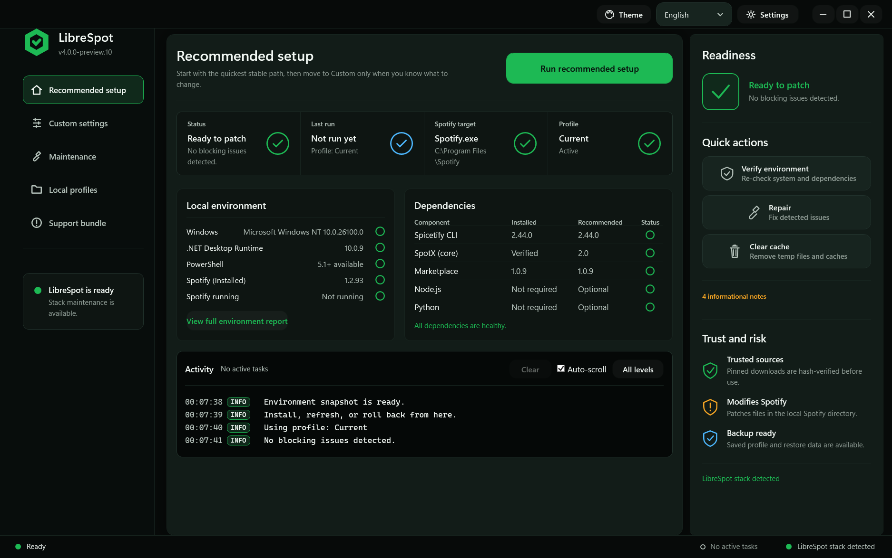
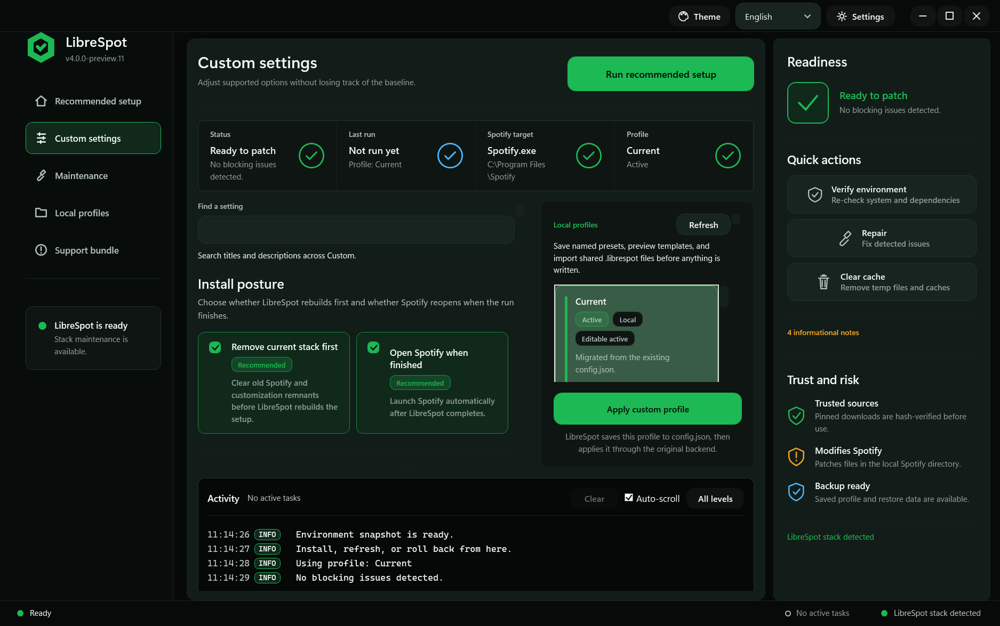
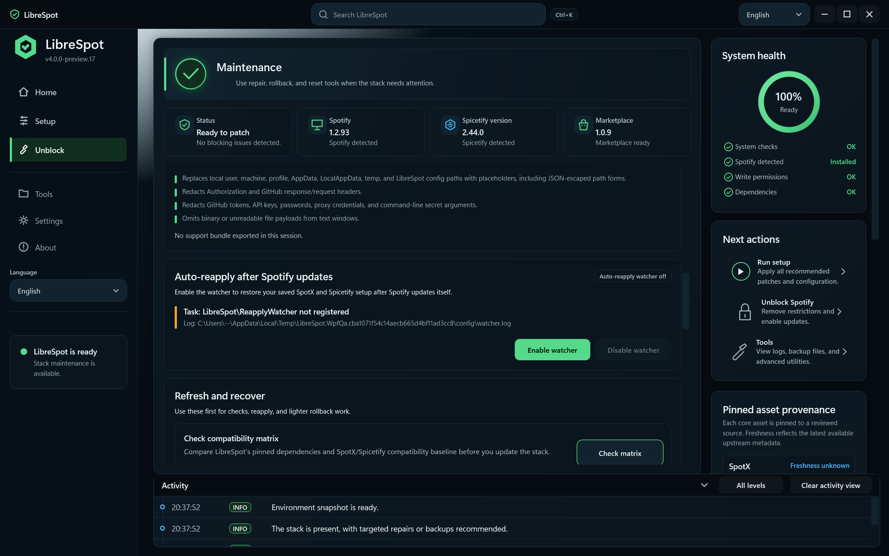
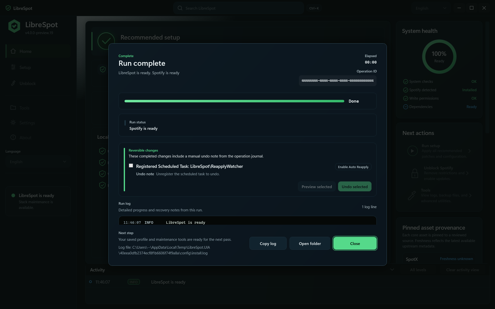

# LibreSpot

**SpotX + Spicetify Unified Installer**

A single-script PowerShell GUI that installs, configures, and maintains ad-free Spotify with themes, extensions, custom apps, and the Spicetify Marketplace — no command-line knowledge required.

[](https://github.com/PowerShell/PowerShell)
[](LICENSE)
[](https://github.com/SysAdminDoc/LibreSpot/releases)
[](https://github.com/SysAdminDoc/LibreSpot/releases)

</div>

## Quick Start

**Verified install** — paste into PowerShell and hit Enter. This downloads `LibreSpot.ps1` and `checksums.txt` from the latest release, validates SHA256 before execution, and saves the script to a reusable local path:

```powershell
$d = "$env:LOCALAPPDATA\LibreSpot\bootstrap"; New-Item -ItemType Directory -Path $d -Force | Out-Null
$base = 'https://github.com/SysAdminDoc/LibreSpot/releases/latest/download'
Invoke-WebRequest "$base/LibreSpot.ps1" -OutFile "$d\LibreSpot.ps1" -UseBasicParsing
Invoke-WebRequest "$base/checksums.txt" -OutFile "$d\checksums.txt" -UseBasicParsing
$expected = ((Get-Content "$d\checksums.txt" | Where-Object { $_ -match 'LibreSpot\.ps1$' }) -split '\s+')[0]
$actual = (Get-FileHash "$d\LibreSpot.ps1" -Algorithm SHA256).Hash
if ($actual -ne $expected) { Remove-Item "$d\LibreSpot.ps1" -Force; throw "SHA256 mismatch — expected $expected, got $actual. The download may be corrupted or tampered with." }
Write-Host "SHA256 verified: $actual" -ForegroundColor Green
& "$d\LibreSpot.ps1"
```

Or [download LibreSpot.ps1](https://github.com/SysAdminDoc/LibreSpot/releases/latest) and right-click **Run with PowerShell**.

<details>
<summary><strong>Advanced: direct pipeline (lower trust)</strong></summary>

The original one-liner executes without checksum verification. Use only if you understand the risk:

```powershell
irm https://github.com/SysAdminDoc/LibreSpot/releases/latest/download/LibreSpot.ps1 | iex
```

This path does not verify the release checksum before execution, cannot self-elevate or register the watcher task reliably, and should not be used for persistent installations.

</details>

> **Requirements:** Windows 10/11, PowerShell 5.1+ (built-in), internet connection. Tested on Windows PowerShell 5.1 and PowerShell 7.6 LTS.

<div align="center">









</div>

---

## What's New in v3.7

**Premium UI overhaul.** Win11 Mica backdrop (with graceful fallback on Windows 10), a left sidebar navigation rail with Lucide icons replacing the old top tab bar, semantic design tokens, hover-lift micro-interactions, and a shimmering install progress bar. Compact density pass means every panel fits a 1080-px screen without scrolling. Same install behavior, polished chrome.

The v4 desktop preview continues that polish with a sharper 6-12 px radius system, quieter scrollbars, cleaner first-run guidance, readable Custom setting cards, a searchable theme gallery, a local profile manager with safe `.librespot` import/export, profile share QR cards, in-app profile comparison text, forced dark native window chrome, completion notifications, a compact status dashboard, issue-level repair buttons, a post-run reversible-changes pane, and calmer activity/support-bundle feedback for assistive technology.

It also registers Windows shell affordances from the running desktop executable: per-user `librespot://` profile links, `.librespot` file imports, jump-list shortcuts, taskbar thumbnail actions, tray minimize/restore, and tray completion notifications that reopen LibreSpot when clicked. Registration is per-user and points at the current executable path, so portable and installed builds both repair stale associations on launch.

---

## What It Does

LibreSpot wraps two powerful open-source projects into one polished interface:

- **[SpotX](https://github.com/SpotX-Official/SpotX)** — patches Spotify to remove ads, block telemetry, and enable experimental UI features
- **[Spicetify](https://github.com/spicetify)** — injects custom themes, extensions, custom apps, and the in-app Marketplace into Spotify

Instead of running multiple scripts, editing config files, and hoping the versions are compatible, LibreSpot handles the entire workflow: clean uninstall, fresh Spotify install, SpotX patching, Spicetify CLI setup, theme installation, extension configuration, verified custom-app installation, and Marketplace deployment — all in the correct order, with full error handling.

---

## Spotify Compatibility

> **Note:** Spotify frequently updates its client, which can break SpotX and Spicetify patches. LibreSpot blocks Spotify auto-updates by default (via SpotX) to keep your installation stable.
>
> If you manually update Spotify and patches stop working, use **Maintenance > Reapply After Update** to re-patch. The WPF Maintenance dashboard also flags **After Spotify update** drift and recommends targeted recovery steps before a full reset.

**Pinned dependency versions (v3.7.2):**

| Component | Pinned Version |
|---|---|
| SpotX | `3284673d` (Spotify 1.2.92) |
| Spicetify CLI | v2.43.2 |
| Marketplace | v1.0.8 |
| Themes | Commit `df033493` |

**Compatibility matrix:** Maintenance > Check matrix reports SpotX, Spicetify CLI, Marketplace, and theme archive status separately. The current SpotX target is Spotify `1.2.92`, while Spicetify CLI v2.43.2 declares Windows/Microsoft Store compatibility through Spotify `1.2.88`; LibreSpot warns about that gap so you can distinguish "SpotX can patch this build" from "Spicetify CSS maps are max-tested on this build."

---

## Features

### Three Modes

**Easy Install** — one click, sensible defaults. Removes any existing installation, applies SpotX ad-blocking with the new UI theme, installs Spicetify CLI with Marketplace, and enables Full App Display, Shuffle+, and Trash Bin extensions.

**Custom Install** — full control over every option. Configure SpotX patching flags (ad-blocking, podcasts, lyrics, UI experiments, update blocking, cache limits), author reviewed SpotX `patches.json` custom patches with JSON formatting, regex safety checks, dry-run feedback, and HTTPS import, browse 21 themes (16 official + 5 community) through a searchable gallery with per-theme color schemes, select from 15 extensions (10 built-in + 5 community) plus the verified Stats custom app, save and preview named local profiles, and choose between clean or overlay install.

**Maintenance** — manage an existing installation without reinstalling. Backup and restore Spicetify configs, reapply patches after Spotify updates, export a redacted local support bundle, restore vanilla Spotify, uninstall Spicetify, check for dependency updates, or perform a full system reset.

### Fleet CLI Preview

`LibreSpot.Cli.exe` is the console-capable fleet artifact for endpoint tools. The implemented verbs are `--version`, `--version --json`, `version --json`, `status --json`, `detect --json`, `detect --intune`, `validate --answer-file <path> --json`, `install --answer-file <path> --profile <name> --ndjson`, `reapply --answer-file <path> --profile <name> --ndjson`, `repair --repair-id <id> --silent --yes --ndjson`, `uninstall --silent --yes --keep-spotify --ndjson`, `install|reapply --dry-run --answer-file <path> --ndjson`, `repair|uninstall --dry-run --ndjson`, `plan --answer-file <path> --json`, `export-support --output <path>`, `watcher install --silent`, and `watcher remove --silent`. `detect --intune` exits `0` only when the existing health report maps to a compliant state; clean slate, drift, blocked, and repair states return documented nonzero fleet exit codes without mutating the machine. Mutating verbs stream stable `LS` NDJSON events from the fleet schema contract, write rotating `.ndjson` logs to `%ProgramData%\LibreSpot\logs` by default, and install/reapply write validated answer-file settings or named answer-file profiles to `config.json` before invoking the shared backend.

Answer-file `spotx.customPatchesEnabled` and `spotx.customPatchesJson` mirror the WPF custom patch editor for reviewed custom SpotX patch sets.

### Fleet Deployment Examples

Executable samples live under `samples/deployment/`. The examples below are
covered by the local parser smoke tests so README commands, sample scripts, and
the CLI grammar stay aligned.

Intune Win32 detection command:

```powershell
LibreSpot.Cli.exe detect --intune
```

Intune Win32 install command, PDQ Deploy install step, or SCCM application
program command:

```powershell
LibreSpot.Cli.exe install --answer-file .\librespot-answer.json --profile standard --silent --yes --no-restart --ndjson
```

PDQ or SCCM repair command using a health-report repair ID:

```powershell
LibreSpot.Cli.exe repair --repair-id RepairMarketplace --silent --yes --ndjson
```

Uninstall LibreSpot customizations while keeping Spotify installed:

```powershell
LibreSpot.Cli.exe uninstall --silent --yes --keep-spotify --ndjson
```

WinRM or PSRemoting over SSH:

```powershell
Invoke-Command -ComputerName PC-42 -ScriptBlock { C:\ProgramData\LibreSpot\LibreSpot.Cli.exe reapply --answer-file C:\ProgramData\LibreSpot\librespot-answer.json --profile standard --silent --yes --no-restart --ndjson }
ssh admin@PC-42 "C:\ProgramData\LibreSpot\LibreSpot.Cli.exe detect --json"
```

Endpoint return-code handling:

| Code | Meaning | Endpoint handling |
|---:|---|---|
| `0` | Success or compliant | Treat as success. |
| `2` | Validation or configuration error | Fail the deployment and review stderr/JSON. |
| `10` | LibreSpot target state not installed | Intune detection should mark app absent. |
| `11` | Drift detected | Run the documented repair or reapply command. |
| `12` | Repair needed | Run a health-report repair ID such as `RepairMarketplace`. |
| `20` | Blocked by local state, such as Spotify running | Retry after closing Spotify or during a maintenance window. |
| `1` | Unexpected backend failure | Collect the NDJSON log and support bundle. |

Mutating examples above write rotating NDJSON logs under
`%ProgramData%\LibreSpot\logs`; add `--log-dir <path>` to redirect logs into an
endpoint-tool collection folder. Use `samples/deployment/librespot-answer.json`
as a starting answer file and keep `riskAcknowledged` explicit in any production
copy.

Package-manager manifests under `packaging/` are draft validation templates,
not public install channels. After a local release build generates
`librespot-release-manifest.json`, run parser-safe validation samples with:

```powershell
.\packaging\Invoke-ValidationSamples.ps1 -Tool all
```

Install-level Scoop and Chocolatey checks are intentionally manual-only; run
them only in a disposable VM with `-RunInstallChecks`.

### Comprehensive Uninstaller

The built-in 8-phase uninstaller handles every trace of Spotify and Spicetify:

1. Process termination (with retry logic)
2. Microsoft Store / AppX removal
3. Native silent uninstaller
4. File system cleanup (Roaming, Local, Temp, cache, shortcuts, glob patterns)
5. Registry cleanup (uninstall keys, protocol handlers, app paths, startup entries)
6. Scheduled task removal
7. Firewall rule removal
8. Verification sweep with retry

### 27 Lyrics Color Themes

Custom Install exposes all 27 SpotX static lyrics color options: spotify, blueberry, blue, discord, forest, fresh, github, lavender, orange, pumpkin, purple, red, strawberry, turquoise, yellow, oceano, royal, krux, pinkle, zing, radium, sandbar, postlight, relish, drot, default, and spotify#2.

### 21 Themes, 200+ Color Schemes

**16 official themes:** Sleek, Dribbblish, Ziro, text, StarryNight, Turntable, Blackout, Blossom, BurntSienna, Default, Dreary, Flow, Matte, Nightlight, Onepunch, and SharkBlue.

**5 community themes:** Catppuccin (4 flavors), Comfy, Bloom (Fluent Design), Lucid (dynamic album-art backgrounds), and Hazy (glassmorphism). Downloaded directly from their GitHub repos.

Each theme ships with its full set of color schemes. **Live theme previews** load inline when selecting a theme in Custom Install. Or skip the theme and use the Marketplace to browse and install themes from within Spotify.

### 15 Extensions (10 Built-in + 5 Community)

**Built-in** (ship with Spicetify CLI):

| Extension | Description |
|---|---|
| Full App Display | Full-screen album art with blur and playback controls |
| Shuffle+ | True Fisher-Yates shuffle instead of Spotify's weighted algorithm |
| Trash Bin | Auto-skip songs and artists you've marked as unwanted |
| Keyboard Shortcuts | Vim-style navigation bindings |
| Bookmark | Save and recall pages, tracks, albums, and timestamps |
| Loopy Loop | Set A-B loop points on any track |
| Pop-up Lyrics | Synchronized lyrics in a separate resizable window |
| Auto Skip Video | Skip canvas videos and region-locked content |
| Auto Skip Explicit | Skip tracks marked as explicit |
| Web Now Playing | Expose now-playing data for Rainmeter widgets |

**Community** (downloaded from GitHub during install):

| Extension | Description |
|---|---|
| [Hide Podcasts](https://github.com/theRealPadster/spicetify-hide-podcasts) | Remove podcast, episode, and audiobook UI elements |
| [Beautiful Lyrics](https://github.com/surfbryce/beautiful-lyrics) | Immersive synced lyrics with dynamic backgrounds and blur |
| [Playlist Icons](https://github.com/jeroentvb/spicetify-playlist-icons) | Custom icons and folder images for playlists |
| [Volume Percentage](https://github.com/daksh2k/spicetify-stuff) | Exact volume percentage next to the slider |
| [Ad-block (Spicetify fallback)](https://github.com/rxri/spicetify-extensions) | Spicetify-layer ad blocking for when SpotX patching fails on a newer Spotify build — **a fallback, not a SpotX replacement** |

### Optional Custom Apps

Custom Install also exposes **Stats** from [harbassan/spicetify-apps](https://github.com/harbassan/spicetify-apps). LibreSpot downloads the pinned `stats-v1.1.3` release ZIP, verifies SHA256, installs it to Spicetify's `CustomApps\stats` directory, and registers `custom_apps = stats`. Stats is off by default. Some Stats views can contact Last.fm when opened inside Spotify.

### Auto-Reapply (new in v3.6.0)

Spotify auto-updates roughly every 1-2 weeks and overwrites the SpotX patches every time. Manually reapplying after every update gets old fast.

**Maintenance > Protect and repair > "Auto-reapply when Spotify updates itself"** registers a per-user scheduled task that fires at logon and every 30 minutes. It silently does nothing unless Spotify's version actually changed; when it changes, it hash-verifies the pinned SpotX script and reruns your saved config — but only when Spotify is closed, so it never interrupts playback. Every action gets logged to `%APPDATA%\LibreSpot\watcher.log` for audit.

You can also manage the task from the command line if you prefer:

```powershell
LibreSpot.ps1 -InstallWatcher      # register the scheduled task
LibreSpot.ps1 -UninstallWatcher    # remove it
LibreSpot.ps1 -Watch               # run one tick manually (what the task invokes)
```

### Other Details

- **Threaded UI** — installation runs in background runspaces; the GUI stays responsive with a live log, elapsed timer, and progress bar
- **Windows shell integration** — WPF builds register `librespot://` and `.librespot` handlers, expose jump-list/taskbar actions, and minimize to a tray icon with clickable completion notices
- **Profile sharing cards** — WPF Custom mode renders an inert local share URI, QR card, selected-profile comparison, embedded changelog preview, and community links without requiring a hosted sharing service
- **Runtime localization** — WPF builds include a persisted language selector with EN, RU, ZH-Hans, PT-BR, and ES resources plus local validation for raw UI strings
- **Window management** — Spotify and installer windows are automatically hidden during installation; LibreSpot stays on top until finished
- **Settings persistence** — your Custom Install configuration is saved to `%APPDATA%\LibreSpot\config.json` and restored next launch
- **Community asset verification** — opt-in community extensions, themes, and custom apps are pinned in `schemas/community-assets.json` with provenance, SHA256, license, branch, support, fallback, and network-behavior metadata; Maintenance health, `status --json`, and support bundles report current/behind/missing/degraded state without failing offline
- **Marketplace visibility evidence** — Reapply and Repair Marketplace record the installed files, manifest version, `custom_apps` registration, Spicetify apply stage, direct `spotify:app:marketplace` open attempt, and last observed Spotify process so Maintenance and `status --json` can distinguish files installed from likely visible
- **Config backup** — up to 5 rotating Spicetify config backups stored in `%USERPROFILE%\LibreSpot_Backups`
- **Architecture support** — x64 and ARM64 with per-architecture hash verification
- **Dual download methods** — falls back to BITS transfer if `Invoke-WebRequest` fails
- **Self-elevating** — auto-requests admin privileges when needed

---

## FAQ

**Will this break if Spotify updates?**
SpotX blocks Spotify auto-updates by default. If you manually update Spotify, use Maintenance > Reapply After Update to re-patch.

**What should I do after Spotify updates?**
Open Maintenance and check the After Spotify update note. LibreSpot compares the current Spotify version with the last patched version, watcher status, Spicetify apply result, and Marketplace state, then points to the safest next action: close Spotify, reapply the saved profile, repair Marketplace, restore vanilla Spotify, or open logs.

**Can I use this with a Premium account?**
Yes. Enable "Premium user (skip ad-blocking)" in Custom Install to skip ad-related patches while keeping all other modifications.

**How do I change my theme later?**
Re-run LibreSpot in Custom mode to pick a different theme, or use the optional Spicetify Marketplace to browse and apply themes from within Spotify. LibreSpot installs your selected themes, extensions, and custom apps directly — Marketplace is an add-on for discovering more, not required.

**Marketplace is installed but I do not see it.**
Use Maintenance > Repair and open Marketplace. LibreSpot reinstalls the custom app, re-enables `custom_apps`, reapplies Spicetify, and opens `spotify:app:marketplace` directly.

**Marketplace-installed themes or extensions reset when Spotify closes.**
This is a known upstream issue (spicetify/cli#3837). Themes and extensions installed through LibreSpot's Custom Install are not affected because they are applied directly. If you rely on Marketplace-only additions, uncheck "Install the Spicetify Marketplace" in Custom mode and choose bundled themes/extensions instead.

**How do I collect diagnostics without leaking local paths or secrets?**
Use Maintenance > Support bundle. LibreSpot previews the selected health report, operation journal, log, and crash-report windows, redacts local user/machine paths, GitHub headers, proxy credentials, tokens, passwords, and command-line secret arguments, then writes a local zip. It does not upload the bundle.

**How do I go back to stock Spotify?**
Use Maintenance > Full Reset. This removes all modifications, uninstalls Spotify, and cleans up every trace.

**Can I migrate from BlockTheSpot?**
BlockTheSpot archived its repository in February 2026. LibreSpot warns when it sees BlockTheSpot-family DLL or config artifacts next to Spotify. A normal install can replace them, and Maintenance > Full Reset is the fallback if you see blank screens or playback failures after patching.

**Is this safe?**
Every download is verified against pinned SHA256 hashes. LibreSpot doesn't host or redistribute any code — it downloads directly from the official SpotX and Spicetify GitHub repositories. See [Trust & risk disclosure](#trust--risk-disclosure) below for enforcement context and account risk details.

**My antivirus flagged LibreSpot / SpotX — is it a virus?**
No. PowerShell scripts that use `Invoke-WebRequest` to download files and modify application directories trigger heuristic alerts from many antivirus engines. SpotX itself is flagged by [16 of 62 VirusTotal vendors](https://github.com/SpotX-Official/SpotX/issues/826) — including Kaspersky, Bitdefender, and others — as a generic "trojan" or "potentially unwanted program." These are pattern-match false positives, not detections of actual malware. LibreSpot's scripts are open source (you can read every line), all downloads are SHA256-verified against pinned hashes, and no compiled code runs that you can't inspect. If your AV quarantines `LibreSpot.ps1` or `SpotX run.ps1`, add an exclusion for the `%APPDATA%\LibreSpot` directory or submit a false-positive report to your vendor.

**Windows SmartScreen says "Unknown publisher" — what do I do?**
LibreSpot's executables are not yet code-signed (SignPath Foundation enrollment is pending). Until signing is in place, Windows SmartScreen will show a warning. Click **More info** → **Run anyway**. The SHA256 checksums in `checksums.txt` on the [Releases page](https://github.com/SysAdminDoc/LibreSpot/releases) verify that the file you downloaded matches the one the build produced.

**Smart App Control blocks the script from running.**
Windows 11 with Smart App Control (SAC) enabled enforces Constrained Language Mode on unsigned PowerShell scripts, which prevents LibreSpot from running. LibreSpot detects this at startup and shows a warning. To use LibreSpot on a SAC-enabled machine: open **Settings → Privacy & security → Windows Security → App & browser control → Smart App Control settings** and switch SAC to **Off**. Alternatively, use the pre-compiled `LibreSpot.exe` from the Releases page — PS2EXE-compiled executables are not blocked by SAC's PowerShell policy. Note: once SAC is turned off, it cannot be re-enabled without reinstalling Windows (on builds before 24H2 KB5083769) or toggling it back in Settings (on 24H2+).

---

## Trust & risk disclosure

**What LibreSpot does:**
- Downloads SpotX and Spicetify CLI directly from their official GitHub repositories using commit-pinned URLs with SHA256 verification
- Patches the local Spotify installation to remove ads and apply themes/extensions
- Optionally registers a scheduled task for automatic reapplication after Spotify updates

**Downloader hardening (CVE-2025-54100):** LibreSpot fetches with PowerShell's `Invoke-WebRequest`. [CVE-2025-54100](https://nvd.nist.gov/vuln/detail/CVE-2025-54100) is a Windows PowerShell 5.1 web-content RCE fixed in the December 2025 Windows cumulative updates. The two mitigations are **SHA256 pinning** (guarantees payload integrity) and **patch level** (keeping Windows updated closes the parse-time vector); SHA256 alone does not remove the vector on an unpatched host. LibreSpot adds a non-blocking preflight that warns when the host predates the December 2025 patch wave. See [SECURITY.md](SECURITY.md#cve-2025-54100--windows-powershell-51-web-content-rce) for details.

**What LibreSpot does NOT do:**
- Collect, transmit, or store any credentials, tokens, or account data
- Bundle, host, or redistribute Spotify binaries or any upstream project code
- Communicate, *as LibreSpot itself*, with any server other than GitHub (for downloads) and Spotify (normal app traffic)
- Modify Spotify's authentication, payment, or account systems

> **Note on community extensions and custom apps:** the bullet above covers LibreSpot itself. Some *opt-in* community entries you can enable in Custom Install do contact their own services — for example, [Beautiful Lyrics](https://github.com/surfbryce/beautiful-lyrics) fetches lyrics from a third-party backend and uses an external API for optional Discord features, while Stats can contact Last.fm-backed views. Entries that talk to a third-party service are flagged in the Custom Install catalog and recorded in [`schemas/community-assets.json`](schemas/community-assets.json) under `networkBehavior`. They are off by default.

**Account risk:**
Spotify's [Terms of Service](https://www.spotify.com/legal/end-user-agreement/) and [User Guidelines](https://www.spotify.com/legal/user-guidelines/) prohibit circumventing ads and modifying the client. While enforcement against individual users of tools like SpotX has not been publicly documented, using LibreSpot is at your own risk. LibreSpot provides a "Full Reset" option in Maintenance mode to return Spotify to its unmodified state at any time.

**Enforcement landscape:**
Spotify has increased enforcement against client modification tools. In September 2025, Spotify DMCA'd ReVanced (which redistributed patched Spotify APKs). In January 2026, Spotify added server-side dual-sync verification that terminated modified mobile app sessions (causing xManager and ReVancedXposed to archive). In February 2026, Spotify tightened Developer Platform access (Premium required for Dev Mode, 1 Client ID per developer, 5 authorized users). BlockTheSpot, which injected DLLs into the Spotify process, archived its repository in February 2026. Desktop patching (SpotX's approach, which LibreSpot wraps) operates at the network/rendering layer and has not been affected by the mobile enforcement wave. LibreSpot does not redistribute patched binaries, does not inject DLLs, does not use Spotify API Client IDs, and downloads only from official upstream GitHub repositories with hash verification. LibreSpot monitors Spotify's first launch after patching for session stability — if Spotify exits unexpectedly within 20 seconds, LibreSpot warns in the install log so you can investigate before assuming the setup is complete. Users should review [Spotify's User Guidelines](https://www.spotify.com/legal/user-guidelines/) and make their own informed decisions.

**Returning to stock Spotify:**
Use Maintenance > Full Reset. This removes all modifications, uninstalls Spotify, and cleans up every trace. You can also manually run `spicetify restore` followed by a clean Spotify reinstall. See [SECURITY.md](SECURITY.md#legal-contingency) for what happens if SpotX or Spicetify are taken down, and how to restore stock Spotify without LibreSpot.

---

## Signing & verification

Releases ship unsigned today. [SignPath Foundation](https://signpath.org/) OSS enrollment is pending. Once the cert arrives, local release builds will Authenticode-sign `LibreSpot.exe`, `LibreSpot-Desktop.exe`, and `LibreSpot.Cli.exe` before upload and users will stop seeing the "Unknown publisher" SmartScreen warning.

The current latest stable release, v3.7.2, ships `LibreSpot.ps1`, `LibreSpot.exe`, and `checksums.txt` **as GitHub release assets**. The repository itself does not track build artifacts — `LibreSpot.exe` and `checksums.txt` are generated fresh for each local release build, so always verify against the copies you downloaded from the [Releases page](https://github.com/SysAdminDoc/LibreSpot/releases), not against anything in a source checkout. Newer local release builds also add the .NET 10 `LibreSpot-Desktop.exe`, `LibreSpot.Cli.exe`, CycloneDX SBOM output, and `librespot-release-manifest.json`.

The recommended Quick Start snippet above verifies `LibreSpot.ps1` automatically. For manual verification of any downloaded release asset:

```powershell
# Compare the hash of each downloaded asset to its line in checksums.txt
Get-FileHash .\LibreSpot.exe  -Algorithm SHA256
Get-FileHash .\LibreSpot.ps1  -Algorithm SHA256
Get-Content  .\checksums.txt
```

GitHub provenance attestations are not produced by the current local release process because this repository intentionally does not track build workflows. Treat `checksums.txt`, the release manifest, and the SBOM as the current verification evidence until signing/provenance work is reintroduced.

## Project planning

Development planning is maintained in local working-tree docs. `ROADMAP.md` is the only active queue for incomplete work; completed work is represented by Git history and release notes.

## Credits

LibreSpot is a wrapper and installer — the real work is done by these projects:

- **[SpotX](https://github.com/SpotX-Official/SpotX)** — Spotify ad-blocking and patching
- **[Spicetify CLI](https://github.com/spicetify/cli)** — Spotify theming and extension framework
- **[Spicetify Marketplace](https://github.com/spicetify/marketplace)** — In-app store for themes and extensions
- **[Spicetify Themes](https://github.com/spicetify/spicetify-themes)** — Official community theme collection

---

## License

[MIT](LICENSE)
