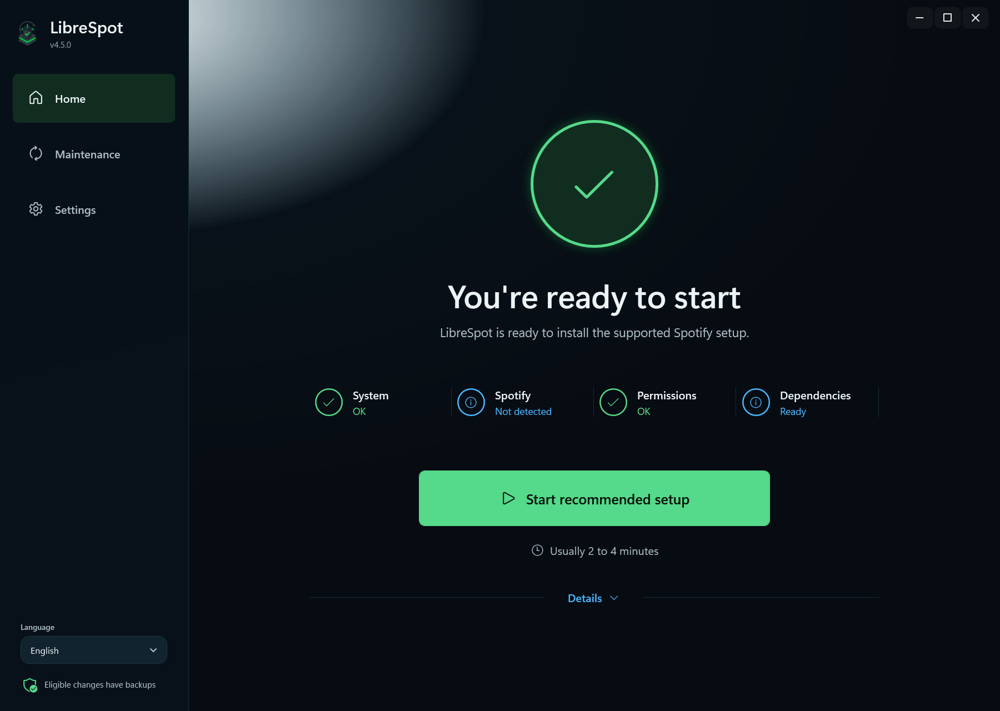
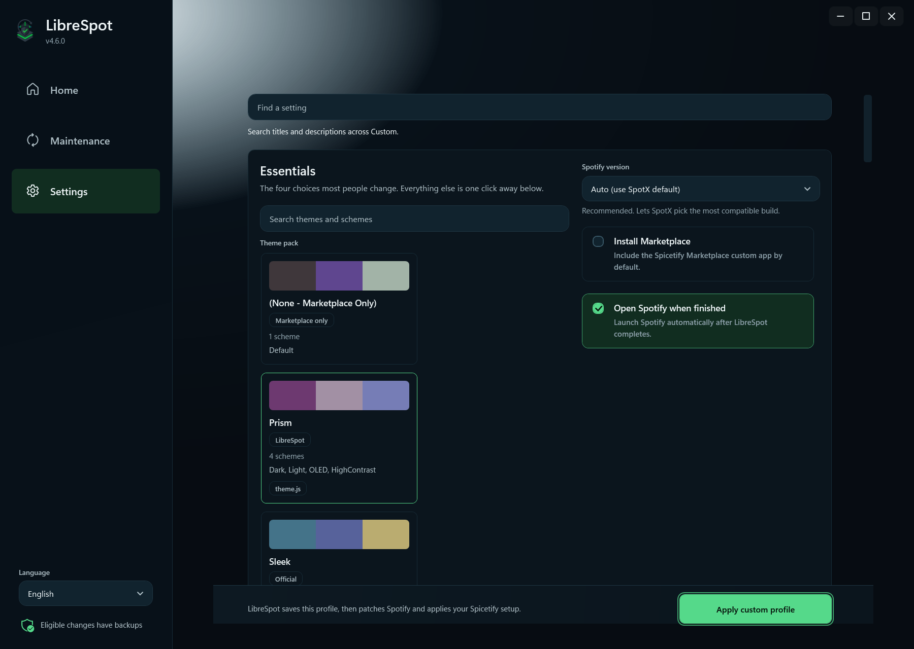
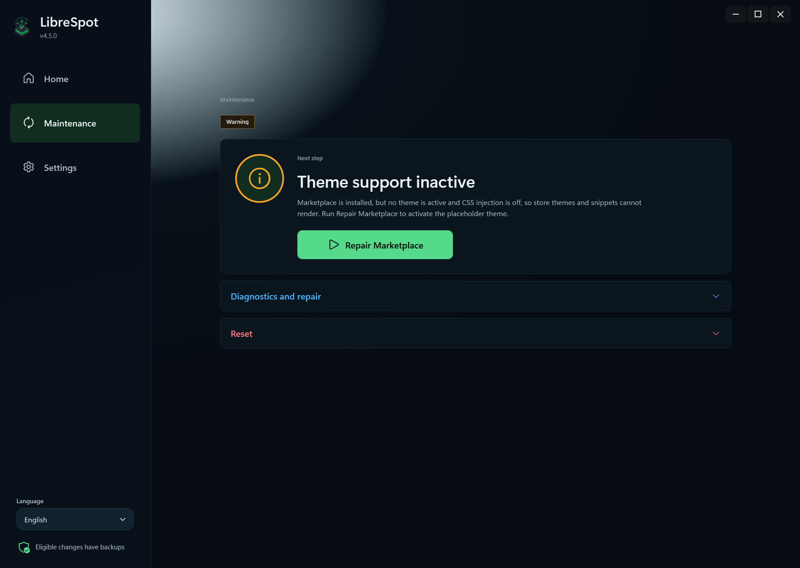
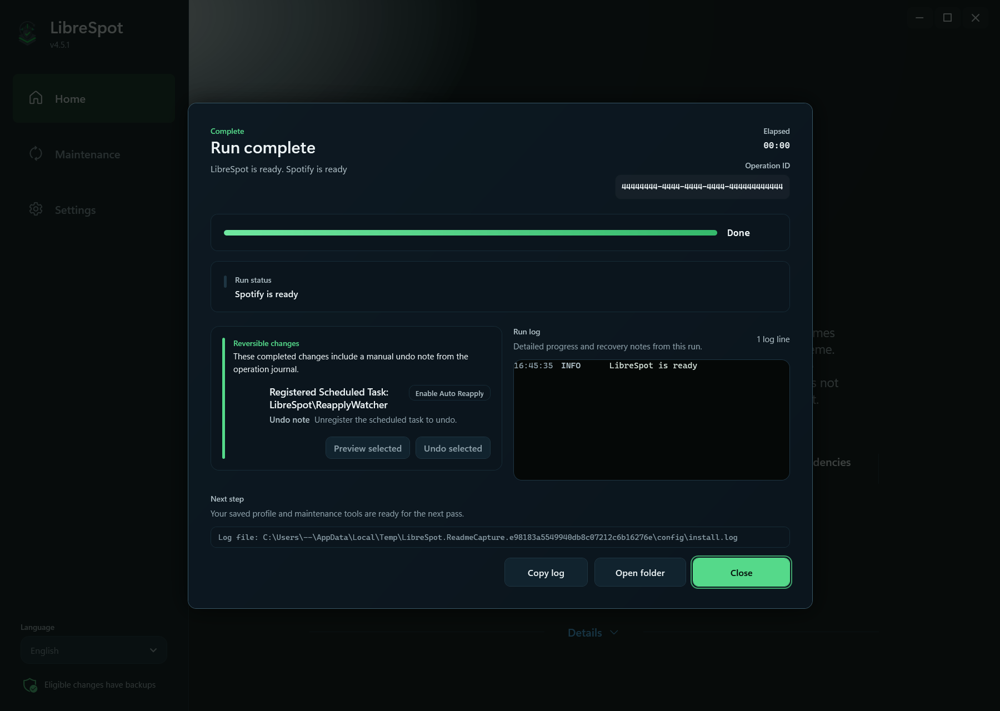

<div align="center">

# LibreSpot

**SpotX + Spicetify Unified Installer**

Installs, configures, and maintains ad-free Spotify with themes, extensions, custom apps, and the Spicetify Marketplace. No command-line knowledge required. v4 ships a Windows desktop app and a fleet CLI alongside the original single-file PowerShell script, so you can run whichever suits the machine in front of you.

[](https://github.com/PowerShell/PowerShell)
[](LICENSE)
[](https://github.com/SysAdminDoc/LibreSpot/releases)
[](https://github.com/SysAdminDoc/LibreSpot/releases/latest)

</div>

## Quick Start

**Verified install**, paste into PowerShell and hit Enter. This downloads `LibreSpot.ps1` and `checksums.txt` from the latest release, validates SHA256 before execution, and saves the script to a reusable local path:

```powershell
$d = "$env:LOCALAPPDATA\LibreSpot\bootstrap"; New-Item -ItemType Directory -Path $d -Force | Out-Null
$base = 'https://github.com/SysAdminDoc/LibreSpot/releases/latest/download'
Invoke-WebRequest "$base/LibreSpot.ps1" -OutFile "$d\LibreSpot.ps1" -UseBasicParsing
Invoke-WebRequest "$base/checksums.txt" -OutFile "$d\checksums.txt" -UseBasicParsing
function Get-LibreSpotBootstrapSha256 {
  param([string]$Path)
  $cmd = Get-Command Get-FileHash -ErrorAction SilentlyContinue
  if ($cmd) { return (Get-FileHash -LiteralPath $Path -Algorithm SHA256).Hash.ToUpperInvariant() }
  $stream = [System.IO.File]::OpenRead($Path); $sha = [System.Security.Cryptography.SHA256]::Create()
  try { return (($sha.ComputeHash($stream) | ForEach-Object { $_.ToString('x2') }) -join '').ToUpperInvariant() }
  finally { $stream.Dispose(); $sha.Dispose() }
}
$expected = (((Get-Content "$d\checksums.txt" | Where-Object { $_ -match 'LibreSpot\.ps1$' }) -split '\s+')[0]).ToUpperInvariant()
$actual = Get-LibreSpotBootstrapSha256 "$d\LibreSpot.ps1"
if ($actual -ne $expected) { Remove-Item "$d\LibreSpot.ps1" -Force; throw "SHA256 mismatch, expected $expected, got $actual. The download may be corrupted or tampered with." }
Write-Host "SHA256 verified: $actual" -ForegroundColor Green
& "$d\LibreSpot.ps1"
```

Or [download LibreSpot.ps1](https://github.com/SysAdminDoc/LibreSpot/releases/latest) and right-click **Run with PowerShell**.

**Prefer a window to a console?** The same release ships `LibreSpot-Desktop.exe`, the v4 desktop app. Download it from the [latest release](https://github.com/SysAdminDoc/LibreSpot/releases/latest), check its SHA256 against `checksums.txt`, and run it. No install, no admin prompt. `LibreSpot.Cli.exe` in the same release is the unattended fleet artifact.

<details>
<summary><strong>Advanced: direct pipeline (lower trust)</strong></summary>

The original one-liner executes without checksum verification. Use only if you understand the risk:

```powershell
irm https://github.com/SysAdminDoc/LibreSpot/releases/latest/download/LibreSpot.ps1 | iex
```

This path does not verify the release checksum before execution, cannot self-elevate or register the watcher task reliably, and should not be used for persistent installations.

</details>

> **Requirements:** Windows 10/11, PowerShell 5.1+ (built-in), internet connection. Tested on Windows PowerShell 5.1 and PowerShell 7.6 LTS.

## How to verify a LibreSpot download

Fake “free Spotify Premium” installers often begin with a video or message that tells you to paste PowerShell. Use the [official LibreSpot repository](https://github.com/SysAdminDoc/LibreSpot) and its linked release page instead.

For a release asset, download `checksums.txt` from that same release page and compare the asset with the matching SHA256 entry:

```powershell
(Get-FileHash .\LibreSpot.ps1 -Algorithm SHA256).Hash
```

Do not use Telegram links, rehosted files, or builds copied to another site. Never paste commands from videos, social posts, or chat messages. If a command asks you to disable Defender or add an exclusion, close it. A hash mismatch means the file must be deleted and not run.

<div align="center">









</div>

---

## What's New in v4.0.0

v4.0.0 is the first stable release of the v4 line. The desktop app and the fleet CLI leave preview, and the single-file PowerShell script ships in the same release for anyone who wants it. Everything below landed across the v4 previews and is now the released behavior.

**One screen that tells you what to do.** The everyday view has three choices: Home, Maintenance, and Settings. Home gives you one readiness result, four checks, and one action chosen from the latest system check. A new setup starts the recommended path, a healthy managed stack opens Spotify, and a known problem offers its first safe repair. Recovery that could remove data opens Maintenance for review instead of running from Home. First-run guidance and technical environment details stay behind the Details row until you ask for them.

**Maintenance puts recovery first.** It shows the most important issue and one safe repair before any technical detail. Diagnostics stay under one labeled section, and reset actions remain separate and collapsed until you choose to review them.

**Recovery actions describe the change they make.** The action formerly called Restore vanilla Spotify removes active Spicetify customizations and says plainly that SpotX stays in place. Home says eligible changes have backups rather than promising that every change can be reversed.

**The app tells you which version it is.** The version sits under the LibreSpot name in the navigation rail, and crash reports record the full product version instead of a shorter numeric one.

**Home recovers from a failed check.** If LibreSpot cannot verify your PC, the screen offers a Retry button instead of naming a control that does not exist. Maintenance behaves the same way rather than looking like Spotify is simply missing.

**Crash reports still appear when the usual folder cannot be created.** LibreSpot writes them under the temp directory in that case, and Open folder goes to wherever the report actually landed.

**Home fits the smallest window.** At the minimum window size the readiness checks used to be cut off at both edges with no way to scroll to them.

**Search boxes tell you what they do.** Settings search and the theme gallery show placeholder text inside the empty field, and the theme box is no longer labeled as if it were the pack picker. The taskbar Jump List says Home and Settings, matching the rail.

**Every language is reachable.** The picker sits at the bottom of the navigation rail, next to the reversible-changes note, and all five interfaces are complete and translation-reviewed.

**One answer about your Spotify build.** Version strings are read through a single parser, so a build carrying a git hash, a trailing note, or a fourth component gets the same verdict on every screen.

**Readable in high contrast, and while you switch.** Disabled controls mute their label instead of fading the whole control below the contrast floor, and turning Windows high contrast on while the app is running recolors the shell immediately rather than waiting for a restart.

LibreSpot refuses to install or reapply over Spicetify v3 artifacts. If the health report shows a Spicetify v3 conflict, run `spicetify restore` first, then reinstall the pinned Spicetify 2.x integration.

**The v3 compatibility contract is fixture-backed.** When a v3 CLI is detected, LibreSpot can read the upstream [`supported-versions.json`](https://raw.githubusercontent.com/spicetify/cli/v3-beta/supported-versions.json) schema-v2 allowlist. Allowlisted versions proceed, versions with a same-minor lower modular map are marked degraded, and versions without a usable fallback are refused. A missing or malformed document now fails closed and points to `spicetify restore` before the pinned 2.x CLI is reinstalled. The pinned Spicetify v2.44.0 path does not activate this contract.

**A smaller shipping shell.** The three workspaces live in dedicated UserControls while preserving localized text, focus behavior, and automation names. Per-user registry, configuration, profile, backup, log, crash, and executable-path isolation is covered by multi-user regression tests.

**Pinned compatibility is executable.** The supported SpotX/Spotify, Spicetify CLI, Marketplace, and theme tuple now has one fixture-backed release contract checked by Windows PowerShell preflight and Core tests.

**The shared core is fully extracted.** All non-UI logic shared by the desktop shell and the fleet CLI, environment snapshotting, upstream/community drift comparison, undo-policy evaluation, backend orchestration, support bundles, the app catalog, and the localized `Strings` resources with their language satellites, now lives once in the WPF-free `LibreSpot.Core` library instead of being compiled into both apps. Behavior is unchanged, but the code is smaller, de-duplicated, and, unlike the WPF shell, able to be mutation-tested. Verified with the full test suite plus an offscreen render of the real shell resolving localized text across languages.

**Provenance-checked Spicetify downloads.** On top of the mandatory SHA256 hash, the pinned Spicetify CLI download now optionally verifies GitHub build-provenance attestations: when the GitHub CLI is present, LibreSpot confirms the artifact was built by Spicetify's own release pipeline against a cached signer identity. A genuine provenance failure raises a trust warning; if the tooling, network, or sign-in is unavailable it quietly falls back to SHA256-only and never blocks the install.

**Sharper upstream guardrails and honest trust docs.** The SpotX pin-advance guardrail now accounts for Spicetify's hard-fail-on-unsupported-version gate (merged upstream after 2.44.0): advancing the pin must confirm the newer Spicetify still applies rather than hard-refusing, not just re-check CSS maps. The signing docs now say LibreSpot ships unsigned by design and SHA256 `checksums.txt` is the permanent verification path. The antivirus FAQ steers users to the compiled desktop executable over the raw script and shows VirusTotal-by-hash verification. The `.NET 10.0.11` CVE-floor rationale records the 2026-08-11 servicing batch it clears.

**Quieter, safer internals.** The Microsoft Store Spotify and Windows Defender exclusion probes no longer risk an unbounded wait when a child process leaves an output pipe open. The accessibility palette gained a regression gate that verifies the primary, destructive, and caution buttons keep their WCAG AA text contrast on every future theme change, not only the body-text tiers that were already covered.

**The store page actually opens now.** SpotX serves Spotify's combined `xpui.js` bundle, but the Spicetify CLI wires the Marketplace route into sibling files that layout never loads. The store opened to a permanently blank page with no errors anywhere. LibreSpot now re-wires the store route into the bundle Spotify actually runs after every apply, verified end to end on a live install. Stack health gains a "Store page not wired" state (all six languages) that detects the broken layout and points straight at Repair Marketplace. The end-of-install launch also warms up the first patched session hidden and restarts Spotify automatically, so the window you sign in to is responsive instead of frozen for its first ten seconds.

**Marketplace that actually works.** The default Marketplace-only setup now follows the official Spicetify Marketplace install contract: LibreSpot creates and activates the placeholder theme and keeps CSS injection on, so store themes and snippets render instead of silently doing nothing, and a managed fallback restores a visible **Marketplace** button in Spotify's top bar when a Spotify redesign breaks Spicetify's own nav link. Marketplace health now warns when the theme contract is inactive and points you to Repair Marketplace, and the post-install launch guarantees a fresh, patched Spotify session.

**Truthful, resilient UX.** Readiness starts in a checking state, reports system, Spotify, permission, and dependency results independently, and replaces success artwork with loading or failure guidance when needed. Maintenance holds the recovery tools. Activity updates announce changing content, translated prompts wrap and scroll safely, and high-contrast and reduced-motion variants share the same interaction contract.

The v4 desktop keeps readable Settings cards, a searchable theme gallery, safe `.librespot` profile import and export, local profile sharing cards, dark native window chrome, completion notifications, issue-level repair buttons, a reversible-changes pane, and assistive-technology feedback. Common users no longer need to see those tools before starting the recommended setup.

It also registers Windows shell affordances from the running desktop executable: per-user `librespot://` profile links, `.librespot` file imports, jump-list shortcuts, taskbar thumbnail actions, tray minimize/restore, and tray completion notifications that reopen LibreSpot when clicked. Registration is per-user and points at the current executable path, so portable and installed builds both repair stale associations on launch.

The desktop rail uses Home, Maintenance, and Settings. Windows protocol and profile-association descriptions follow the saved interface language.

---

## What It Does

LibreSpot wraps two powerful open-source projects into one polished interface:

- **[SpotX](https://github.com/SpotX-Official/SpotX)**, patches Spotify to remove ads, block telemetry, and enable experimental UI features
- **[Spicetify](https://github.com/spicetify)**, injects custom themes, extensions, custom apps, and the in-app Marketplace into Spotify

Instead of running multiple scripts, editing config files, and hoping the versions are compatible, LibreSpot handles the entire workflow: clean uninstall, fresh Spotify install, SpotX patching, Spicetify CLI setup, theme installation, extension configuration, verified custom-app installation, and Marketplace deployment, all in the correct order, with full error handling.

The desktop shell keeps each workspace in a named UserControl. The Custom workspace is further divided into install, appearance, behavior, advanced, patch, extension, app, and profile sections, so the UI and its code-behind stay easy to trace without changing the user-facing workflow.

---

## Spotify Compatibility

> **Note:** Spotify frequently updates its client, which can break SpotX and Spicetify patches. LibreSpot blocks Spotify auto-updates by default (via SpotX) to keep your installation stable.
>
> If you manually update Spotify and patches stop working, use **Maintenance > Reapply After Update** to re-patch. The WPF Maintenance dashboard also flags **After Spotify update** drift and recommends targeted recovery steps before a full reset.

Current source script version: **v3.7.4**. Public latest stable release: **v4.0.0**.

**Pinned dependency versions in the current source script:**

| Component | Pinned Version |
|---|---|
| SpotX | `550bc72c` (Spotify 1.2.93) |
| Spicetify CLI | v2.44.0 |
| Marketplace | v1.0.9 |
| Themes | Commit `df033493` |

**Compatibility matrix:** Maintenance > Check matrix reports SpotX, Spicetify CLI, Marketplace, and theme archive status separately. The Maintenance workspace also shows detected Spotify, SpotX, Spicetify CLI, and Marketplace values beside the pinned tuple, with a supported, degraded, unsupported, or unknown verdict and a next step for each state. The current SpotX target is Spotify `1.2.93`, and Spicetify CLI v2.44.0 declares Windows/Microsoft Store compatibility through Spotify `1.2.93`. The supported tuple is recorded in `schemas/compatibility-baseline.json`; `Build-Scripts.ps1 -Validate` and the Core contract tests fail if the PowerShell pins, WPF/CLI constants, or documented range drift apart.

**Why the SpotX pin holds (verified 2026-08-20):** SpotX `main` now targets Spotify 1.2.94 and, since commit `afb4c3f` (2026-07-11), adds Microsoft Defender exclusions by default (opt-out `-defender_exclusions_off`). Spicetify CLI 2.44.0 still tops out at Spotify 1.2.93. LibreSpot deliberately holds the pre-Defender SpotX commit `550bc72c` at Spotify 1.2.93 to match Spicetify's tested ceiling and avoid weakening Defender. The policy boundary is recorded as `afb4c3fc` in the pinned metadata. A changed SpotX commit must declare the post-boundary policy, declare the exact `-defender_exclusions_off` adapter argument, and prove that argument is passed before any exclusion command can run. The SpotX pin and Spotify target advance together only once Spicetify declares 1.2.94+ support. The advance must also confirm the newer Spicetify build still applies rather than hard-refusing: `spicetify/cli` `main` merged a hard-fail-on-unsupported-version gate after 2.44.0, so a future build can refuse `backup apply` on Spotify versions above its declared ceiling instead of best-effort patching. The pinned 2.44.0 predates that gate, which is why LibreSpot's post-apply route re-wiring works on 1.2.94.

---

## Features

### Three Modes

**Recommended setup**, one click, sensible defaults. Removes any existing installation, applies SpotX ad-blocking with the new UI theme, installs Spicetify CLI with Marketplace, and enables Full App Display, True Shuffle, and Trash Bin extensions.

**Custom Install**, full control over every option. Configure SpotX patching flags (ad-blocking, podcasts, lyrics, UI experiments, update blocking, cache limits), author reviewed SpotX `patches.json` custom patches with JSON formatting, regex safety checks, dry-run feedback, and HTTPS import, browse 21 themes (16 official + 5 community) through a searchable gallery with per-theme color schemes, select from 15 extensions (10 built-in + 5 community) plus the verified Stats custom app, save and preview named local profiles, and choose between clean or overlay install.

**Maintenance**, manage an existing installation without reinstalling. Backup and restore Spicetify configs, reapply patches after Spotify updates, inspect and clear verified download-cache health, preview and explicitly undo eligible low-risk PATH changes from the latest operation receipt, export a validated Marketplace state archive for missing-file recovery, export a redacted local support bundle, remove active Spicetify customizations while keeping SpotX in place, uninstall Spicetify, check for dependency updates, or perform a full system reset. Marketplace 1.0.9 stores saved state in the embedded browser's IndexedDB database. LibreSpot detects that boundary but does not back it up. Use Marketplace's own export/import controls before a repair or reset.

### Capability boundary

LibreSpot changes the local desktop client. It does not grant Spotify Premium or change account entitlements.

| Capability | LibreSpot's boundary |
|---|---|
| Desktop ad patching | Supported as documented, with the account risk described below. |
| Spotify Premium access | Not granted. LibreSpot cannot turn a free account into Premium. |
| Offline downloads, lossless audio, and Very High quality | Not unlocked. These remain Spotify account or service capabilities. |
| Mobile on-demand playback and Jams | Not unlocked. LibreSpot is a Windows desktop tool. |
| Lyrics availability | Not unlocked. Availability remains controlled by Spotify, your account, and your region. |
| Existing Premium account | Use Custom Install's **Premium account (skip ad-blocking)** option to leave ad-related patches off. |

Maintenance > Full Reset can return the local Spotify installation to its stock state. It does not change your Spotify subscription or account entitlements.

### Fleet CLI

`LibreSpot.Cli.exe` is the console-capable fleet artifact for endpoint tools. It ships stable as of v4.0.0. The implemented verbs are `--version`, `--version --json`, `version --json`, `status --json`, `detect --json`, `detect --intune`, `validate --answer-file <path> --json`, `install --answer-file <path> --profile <name> --ndjson`, `reapply --answer-file <path> --profile <name> --ndjson`, `repair --repair-id <id> --silent --yes --ndjson`, `uninstall --silent --yes --keep-spotify --ndjson`, `install|reapply --dry-run --answer-file <path> --ndjson`, `repair|uninstall --dry-run --ndjson`, `plan --answer-file <path> --json`, `undo --operation-id <id> --token-kind <kind> --dry-run --json`, `undo --operation-id <id> --token-kind <kind> --yes --json`, `export-support --output <path>`, `watcher install --silent`, and `watcher remove --silent`. `repair --repair-id ExportMarketplaceState` writes a timestamped archive under `%USERPROFILE%\LibreSpot_Backups\MarketplaceState`; `RestoreMarketplaceState` restores only missing files from the newest validated archive and then reapplies when Spicetify is available. Neither operation exports or claims to restore the embedded Marketplace IndexedDB database. Use Marketplace's own export/import controls for that state. `status --json` schema v3 includes structured patcher ownership plus asset-cache inventory counts, byte totals, stale/corrupt state, and per-entry labels when available, and each pinned upstream/community asset's source URL, version or commit, last-verification timestamp, changelog/release link, and freshness state. `detect --intune` exits `0` only when the existing health report maps to a compliant state; clean slate, drift, blocked, and repair states return documented nonzero fleet exit codes without mutating the machine. Mutating backend verbs stream stable `LS` NDJSON events from the fleet schema contract, write rotating `.ndjson` logs to `%ProgramData%\LibreSpot\logs` by default, and install/reapply write validated answer-file settings or named answer-file profiles to `config.json` before invoking the shared backend. One operation GUID now follows the command into the PowerShell journal and appears in CLI JSON/plain output, desktop activity, rolling logs, crash reports, and support-bundle manifests. Local EventPipe/ETW collectors can also subscribe to the `LibreSpot-Operations` EventSource; LibreSpot does not upload this telemetry.

The current `--help` output lists every flag declared by `schemas/fleet-cli-contract.json` for each verb, including the destructive uninstall requirements.

Answer-file `spotx.customPatchesEnabled` and `spotx.customPatchesJson` mirror the WPF custom patch editor for reviewed custom SpotX patch sets.

Undo is deliberately narrower than general rollback: select the source operation and token exactly as reported by the latest receipt, review `--dry-run`, then pass `--yes`. The current allowlist restores only captured user-PATH additions when the registry value, type, and fingerprint still match; stale, unknown, elevated, destructive, and non-low-risk tokens are refused without mutation.

### Fleet Deployment Examples

Executable samples live under `samples/deployment/`. The examples below are
covered by the local parser smoke tests so README commands, sample scripts, and
the CLI grammar stay aligned.

Intune Win32 detection command:

```powershell
LibreSpot.Cli.exe detect --intune
```

Intune Win32 install command, PDQ Deploy install step, or SCCM application
program command:

```powershell
LibreSpot.Cli.exe install --answer-file .\librespot-answer.json --profile standard --silent --yes --no-restart --ndjson
```

PDQ or SCCM repair command using a health-report repair ID:

```powershell
LibreSpot.Cli.exe repair --repair-id RepairMarketplace --silent --yes --ndjson
```

Uninstall LibreSpot customizations while keeping Spotify installed:

```powershell
LibreSpot.Cli.exe uninstall --silent --yes --keep-spotify --ndjson
```

WinRM or PSRemoting over SSH:

```powershell
Invoke-Command -ComputerName PC-42 -ScriptBlock { C:\ProgramData\LibreSpot\LibreSpot.Cli.exe reapply --answer-file C:\ProgramData\LibreSpot\librespot-answer.json --profile standard --silent --yes --no-restart --ndjson }
ssh admin@PC-42 "C:\ProgramData\LibreSpot\LibreSpot.Cli.exe detect --json"
```

Endpoint return-code handling:

| Code | Meaning | Endpoint handling |
|---:|---|---|
| `0` | Success or compliant | Treat as success. |
| `2` | Validation or configuration error | Fail the deployment and review stderr/JSON. |
| `10` | LibreSpot target state not installed | Intune detection should mark app absent. |
| `11` | Drift detected | Run the documented repair or reapply command. |
| `12` | Repair needed | Run a health-report repair ID such as `RepairMarketplace`. |
| `20` | Blocked by local state, such as Spotify running | Retry after closing Spotify or during a maintenance window. |
| `1` | Unexpected backend failure | Collect the NDJSON log and support bundle. |

Mutating examples above write rotating NDJSON logs under
`%ProgramData%\LibreSpot\logs`; add `--log-dir <path>` to redirect logs into an
endpoint-tool collection folder. Use `samples/deployment/librespot-answer.json`
as a starting answer file and keep `riskAcknowledged` explicit in any production
copy.

Package-manager distribution remains disabled. The local release manifest is
the source of truth for the seven published assets, and there are no checked-in
package templates or install-level package checks.

### Comprehensive Uninstaller

The built-in 8-phase uninstaller handles every trace of Spotify and Spicetify:

1. Process termination (with retry logic)
2. Microsoft Store / AppX removal
3. Native silent uninstaller
4. File system cleanup (Roaming, Local, Temp, cache, shortcuts, glob patterns)
5. Registry cleanup (uninstall keys, protocol handlers, app paths, startup entries)
6. Scheduled task removal
7. Firewall rule removal
8. Verification sweep with retry

### 27 Lyrics Color Themes

Custom Install exposes all 27 SpotX static lyrics color options: spotify, blueberry, blue, discord, forest, fresh, github, lavender, orange, pumpkin, purple, red, strawberry, turquoise, yellow, oceano, royal, krux, pinkle, zing, radium, sandbar, postlight, relish, drot, default, and spotify#2.

### 21 Themes, 200+ Color Schemes

**16 official themes:** Sleek, Dribbblish, Ziro, text, StarryNight, Turntable, Blackout, Blossom, BurntSienna, Default, Dreary, Flow, Matte, Nightlight, Onepunch, and SharkBlue.

**5 community themes:** Catppuccin (4 flavors), Comfy, Bloom (Fluent Design), Lucid (dynamic album-art backgrounds), and Hazy (glassmorphism). Downloaded directly from their GitHub repos.

Each theme ships with its full set of color schemes. **Live theme previews** load inline when selecting a theme in Custom Install. Or skip the theme and use the Marketplace to browse and install themes from within Spotify.

### 15 Extensions (10 Built-in + 5 Community)

**Built-in** (ship with Spicetify CLI):

| Extension | Description |
|---|---|
| Full App Display | Full-screen album art with blur and playback controls |
| True Shuffle | Fisher-Yates shuffle instead of Spotify's weighted algorithm |
| Trash Bin | Auto-skip songs and artists you've marked as unwanted |
| Keyboard Shortcuts | Vim-style navigation bindings |
| Bookmark | Save and recall pages, tracks, albums, and timestamps |
| Loopy Loop | Set A-B loop points on any track |
| Pop-up Lyrics | Synchronized lyrics in a separate resizable window |
| Auto Skip Video | Skip canvas videos and region-locked content |
| Auto Skip Explicit | Skip tracks marked as explicit |
| Web Now Playing | Expose now-playing data for Rainmeter widgets |

**Community** (downloaded from GitHub during install):

| Extension | Description |
|---|---|
| [Hide Podcasts](https://github.com/theRealPadster/spicetify-hide-podcasts) | Remove podcast, episode, and audiobook UI elements |
| [Beautiful Lyrics](https://github.com/surfbryce/beautiful-lyrics) | Immersive synced lyrics with dynamic backgrounds and blur |
| [Playlist Icons](https://github.com/jeroentvb/spicetify-playlist-icons) | Custom icons and folder images for playlists |
| [Volume Percentage](https://github.com/daksh2k/spicetify-stuff) | Exact volume percentage next to the slider |
| [Ad-block (Spicetify fallback)](https://github.com/rxri/spicetify-extensions) | Spicetify-layer ad blocking for when SpotX patching fails on a newer Spotify build, **a fallback, not a SpotX replacement** |

### Optional Custom Apps

Custom Install also exposes **Stats** from [harbassan/spicetify-apps](https://github.com/harbassan/spicetify-apps). LibreSpot downloads the pinned `stats-v1.1.3` release ZIP, verifies SHA256, installs it to Spicetify's `CustomApps\stats` directory, and registers `custom_apps = stats`. Stats is off by default. Some Stats views can contact Last.fm when opened inside Spotify.

### Auto-Reapply (new in v3.6.0)

Spotify auto-updates roughly every 1-2 weeks and overwrites the SpotX patches every time. Manually reapplying after every update gets old fast.

**Maintenance > Protect and repair > "Auto-reapply when Spotify updates itself"** registers a per-user scheduled task that fires at logon and every 30 minutes. It silently does nothing unless Spotify's version actually changed; when it changes, it hash-verifies the pinned SpotX script and reruns your saved config, but only when Spotify is closed, so it never interrupts playback. Every action gets logged to `%APPDATA%\LibreSpot\watcher.log` for audit.

You can also manage the task from the command line if you prefer:

```powershell
LibreSpot.ps1 -InstallWatcher      # register the scheduled task
LibreSpot.ps1 -UninstallWatcher    # remove it
LibreSpot.ps1 -Watch               # run one tick manually (what the task invokes)
LibreSpot.ps1 -Clean               # pre-tick Recommended setup + Clean Install for a one-shot rebuild
LibreSpot.ps1 -RemoveSelfData      # unregister the watcher and delete all LibreSpot-owned data, then exit
```

### Other Details

- **Threaded UI**, installation runs in background runspaces; the GUI stays responsive with a live log, elapsed timer, and progress bar
- **Windows shell integration**, WPF builds register `librespot://` sharing and `.librespot` Explorer handlers, route double-clicked profile files through the validated preview/confirm flow, expose jump-list/taskbar actions, and minimize to a tray icon with clickable completion notices
- **Least-privilege desktop workflow**, WPF setup and maintenance run in the current standard-user session without relaunching the whole app through UAC; the legacy PowerShell and PS2EXE entry points retain their existing self-elevation behavior
- **Profile sharing cards**, WPF Custom mode renders an inert local share URI, QR card, selected-profile comparison, embedded changelog preview, and community links without requiring a hosted sharing service
- **Runtime localization**, WPF builds include a persisted language selector with reviewed EN, RU, ZH-Hans, PT-BR, and ES resources; validation rejects missing/raw UI strings, broken placeholders, translated product/file tokens, and unreviewed English carry-over
- **Window management**, Spotify and installer windows are automatically hidden during installation; LibreSpot stays on top until finished
- **Settings persistence**, your Custom Install configuration is saved to `%APPDATA%\LibreSpot\config.json` and restored next launch
- **Community asset verification**, opt-in community extensions, themes, and custom apps are pinned in `schemas/community-assets.json` with provenance, SHA256, license, branch, support, fallback, network-behavior, and catalog-review metadata; the review gate rejects archived, stale, undocumented, or unknown-network entries from easy-mode defaults while retaining deferred entries as opt-in, and Maintenance health, `status --json`, and redacted support bundles report the decision and reason without failing offline
- **Community catalog:** browse the reviewed asset list and its trust evidence on the [LibreSpot community catalog](https://sysadmindoc.github.io/LibreSpot/), generated from the same schemas used by the local review gate
- **Marketplace visibility evidence**, Reapply and Repair Marketplace record the installed files, manifest version, `custom_apps` registration, Spicetify apply stage, direct `spotify:app:marketplace` open attempt, and last observed Spotify process so Maintenance and `status --json` can distinguish files installed from likely visible
- **Repair preservation**, before Reapply or Repair Marketplace replaces managed Spicetify files, LibreSpot snapshots `config-xpui.ini` and `CustomApps` under `%USERPROFILE%\LibreSpot_Backups`, restores only missing files, and retains support-bundle evidence. The Marketplace IndexedDB database is detected but not backed up, so use Marketplace's own export/import controls before repair and expect that state may reset
- **Asset-cache inventory**, verified download-cache entries keep source labels, source URLs, byte size, first-seen, last-used, and last-verified metadata; corrupt files are quarantined with journal receipts, and Maintenance, `status --json`, and support bundles show cache count, size, stale, corrupt, and clear-cache state
- **Config backup**, up to 5 rotating Spicetify config backups stored in `%USERPROFILE%\LibreSpot_Backups`
- **Architecture support**, x64 and ARM64 with per-architecture hash verification
- **Dual download methods**, falls back to BITS transfer if `Invoke-WebRequest` fails
- **Self-elevating**, auto-requests admin privileges when needed

---

## FAQ

**Will this break if Spotify updates?**
SpotX blocks Spotify auto-updates by default. If you manually update Spotify, use Maintenance > Reapply After Update to re-patch.

**What should I do after Spotify updates?**
Open Maintenance and check the After Spotify update note. LibreSpot compares the current Spotify version with the last patched version, watcher status, Spicetify apply result, and Marketplace state, then points to the safest next action: close Spotify, reapply the saved profile, repair Marketplace, remove Spicetify customizations, or open logs.

**Can I use this with a Premium account?**
Yes. Enable "Premium account (skip ad-blocking)" in Custom Install to skip ad-related patches while keeping all other modifications.

**How do I change my theme later?**
Re-run LibreSpot in Custom mode to pick a different theme, or use the optional Spicetify Marketplace to browse and apply themes from within Spotify. LibreSpot installs your selected themes, extensions, and custom apps directly, Marketplace is an add-on for discovering more, not required.

**Marketplace is installed but I do not see it.**
Use Maintenance > Repair and open Marketplace. LibreSpot reinstalls the custom app, re-enables `custom_apps`, reapplies Spicetify, and opens `spotify:app:marketplace` directly.

**Marketplace-installed themes or extensions reset when Spotify closes.**
This is a known upstream issue (spicetify/cli#3837). Themes and extensions installed through LibreSpot's Custom Install are not affected because they are applied directly. If you rely on Marketplace-only additions, uncheck "Install the Spicetify Marketplace" in Custom mode and choose bundled themes/extensions instead.

**How do I collect diagnostics without leaking local paths or secrets?**
Use Maintenance > Support bundle. LibreSpot previews the selected health report, operation journal, log, and crash-report windows, redacts local user/machine paths, GitHub headers, proxy credentials, tokens, passwords, and command-line secret arguments, then writes a local zip. The manifest includes the latest stable operation GUID so support evidence can be matched to the activity dialog and logs. It does not upload the bundle.

**What does Remove LibreSpot Data erase?**
Maintenance > Remove LibreSpot data (in the v4 desktop app) deletes LibreSpot-owned config, local profiles, operation journals, logs, crashes, verified cache, backups, and watcher state while leaving Spotify and Spicetify files untouched. It writes a path-free irreversible receipt to `%TEMP%\LibreSpot\remove-self-data-receipt.latest.json`. In the stable script, run `LibreSpot.ps1 -RemoveSelfData` for the same cleanup.

**How do I go back to stock Spotify?**
Use Maintenance > Full Reset. This removes all modifications, uninstalls Spotify, and cleans up every trace.

**Can I migrate from BlockTheSpot?**
BlockTheSpot archived its repository in February 2026. LibreSpot's environment health report distinguishes likely BlockTheSpot-family DLL/config artifacts, raw SpotX backups, standalone Spicetify, and LibreSpot-owned state before setup. Review the migration recommendation first: standalone Spicetify config and CustomApps are preserved before setup, while Full Reset removes foreign Spotify state only after its destructive confirmation. The same ownership result is available through CLI status JSON and local support bundles.

**Is this safe?**
Every download is verified against pinned SHA256 hashes. LibreSpot doesn't host or redistribute any code, it downloads directly from the official SpotX and Spicetify GitHub repositories. See [Trust & risk disclosure](#trust--risk-disclosure) below for enforcement context and account risk details.

**My antivirus flagged LibreSpot / SpotX, is it a virus?**
A detection alone cannot answer that. Security products can flag scripts and patched application files for several reasons, and LibreSpot will not label a detection harmless on your behalf. Stop before allowing or restoring the file. Confirm that it came from the [official LibreSpot release](https://github.com/SysAdminDoc/LibreSpot/releases) or the pinned upstream source, then compare its SHA256 with the matching entry in that same release's `checksums.txt` or LibreSpot's logged pin. A matching hash establishes file identity, not safety. If the source or hash does not match, or cannot be confirmed, leave the file blocked and delete the download. If both match, review the detection in Windows Security Protection History and submit the exact file to [Microsoft Security Intelligence](https://www.microsoft.com/en-us/wdsi/filesubmission) or your security vendor for analysis. Do not add an antivirus exclusion or turn off protection for LibreSpot.

**Windows SmartScreen says "Unknown publisher", what do I do?**
LibreSpot ships unsigned by design and is not code-signed. [SignPath Foundation](https://signpath.org/) OSS signing was evaluated and set aside, so there is no pending certificate to wait for. Do not bypass the warning merely because this README says the project is legitimate. First confirm that the file came from the official Releases page and that its SHA256 matches `checksums.txt` from the same release. A match proves identity only. Continue only when your Windows policy permits unsigned software and you have independently accepted that risk. Leave the file blocked if you are unsure.

**Smart App Control blocks the script from running.**
Leave Smart App Control enabled. It blocks untrusted or unsigned code by design, and LibreSpot does not provide or recommend a bypass. On a managed device, ask the administrator whether an approved LibreSpot artifact is allowed. On a personal device, use only an artifact that Windows Security accepts under the current policy, or do not run LibreSpot.

---

## Trust & risk disclosure

**What LibreSpot does:**
- Downloads SpotX and Spicetify CLI directly from their official GitHub repositories using commit-pinned URLs with SHA256 verification
- Patches the local Spotify installation to remove ads and apply themes/extensions
- Optionally registers a scheduled task for automatic reapplication after Spotify updates

**Downloader hardening (CVE-2025-54100):** LibreSpot fetches with PowerShell's `Invoke-WebRequest`. [CVE-2025-54100](https://nvd.nist.gov/vuln/detail/CVE-2025-54100) is a Windows PowerShell 5.1 web-content RCE fixed in the December 2025 Windows cumulative updates. The two mitigations are **SHA256 pinning** (guarantees payload integrity) and **patch level** (keeping Windows updated closes the parse-time vector); SHA256 alone does not remove the vector on an unpatched host. LibreSpot adds a non-blocking preflight that warns when the host predates the December 2025 patch wave. See [SECURITY.md](SECURITY.md#cve-2025-54100--windows-powershell-51-web-content-rce) for details.

PowerShell 7.6.0 through 7.6.4 also receive a non-blocking security-floor warning for CVE-2026-50523 and related August 2026 fixes. Update to PowerShell 7.6.5 or later before continuing. See [SECURITY.md](SECURITY.md#powershell-760-through-764-security-floor) for details.

**What LibreSpot does NOT do:**
- Collect, transmit, or store any credentials, tokens, or account data
- Bundle, host, or redistribute Spotify binaries or any upstream project code
- Communicate, *as LibreSpot itself*, with any server other than GitHub (for downloads) and Spotify (normal app traffic)
- Modify Spotify's authentication, payment, or account systems

> **Note on community extensions and custom apps:** the bullet above covers LibreSpot itself. Some *opt-in* community entries you can enable in Custom Install do contact their own services, for example, [Beautiful Lyrics](https://github.com/surfbryce/beautiful-lyrics) fetches lyrics from a third-party backend and uses an external API for optional Discord features, while Stats can contact Last.fm-backed views. Entries that talk to a third-party service are flagged in the Custom Install catalog and recorded in [`schemas/community-assets.json`](schemas/community-assets.json) under `networkBehavior`. They are off by default.

**Account risk:**
Spotify's [Terms of Service](https://www.spotify.com/legal/end-user-agreement/) and [User Guidelines](https://www.spotify.com/legal/user-guidelines/) prohibit circumventing ads and modifying the client. While enforcement against individual users of tools like SpotX has not been publicly documented, using LibreSpot is at your own risk. LibreSpot provides a "Full Reset" option in Maintenance mode to return Spotify to its unmodified state at any time.

**Enforcement landscape:**
Spotify has increased enforcement against client modification tools. In September 2025, Spotify DMCA'd ReVanced (which redistributed patched Spotify APKs). In January 2026, Spotify added server-side dual-sync verification that terminated modified mobile app sessions (causing xManager and ReVancedXposed to archive). In February 2026, Spotify tightened Developer Platform access (Premium required for Dev Mode, 1 Client ID per developer, 5 authorized users). BlockTheSpot, which injected DLLs into the Spotify process, archived its repository in February 2026. Desktop patching (SpotX's approach, which LibreSpot wraps) operates at the network/rendering layer and has not been affected by the mobile enforcement wave. LibreSpot does not redistribute patched binaries, does not inject DLLs, does not use Spotify API Client IDs, and downloads only from official upstream GitHub repositories with hash verification. LibreSpot monitors Spotify's first launch after patching for session stability, if Spotify exits unexpectedly within 20 seconds, LibreSpot warns in the install log so you can investigate before assuming the setup is complete. Users should review [Spotify's User Guidelines](https://www.spotify.com/legal/user-guidelines/) and make their own informed decisions.

**Returning to stock Spotify:**
Use Maintenance > Full Reset. This removes all modifications, uninstalls Spotify, and cleans up every trace. You can also manually run `spicetify restore` followed by a clean Spotify reinstall. See [SECURITY.md](SECURITY.md#legal-contingency) for what happens if SpotX or Spicetify are taken down, and how to restore stock Spotify without LibreSpot.

---

## Signing & verification

Releases ship unsigned by design. LibreSpot is not code-signed and is not waiting on a certificate: [SignPath Foundation](https://signpath.org/) OSS signing was evaluated and set aside, so there is no "once the cert arrives" milestone. `LibreSpot.exe`, `LibreSpot-Desktop.exe`, and `LibreSpot.Cli.exe` are published as unsigned artifacts, and Windows SmartScreen may warn about them. Verify identity with the SHA256 `checksums.txt` published alongside each release. A matching hash proves that the file is the release artifact, but it does not prove that the file is safe.

The public latest stable release, v4.0.0, ships seven assets: `LibreSpot.ps1`, `LibreSpot.exe`, the .NET 10 `LibreSpot-Desktop.exe` and `LibreSpot.Cli.exe`, the CycloneDX SBOM, `checksums.txt`, and `librespot-release-manifest.json`. The repository itself does not track build artifacts. `LibreSpot.exe` and `checksums.txt` are generated fresh for each local release build, so always verify against the copies you downloaded from the [latest stable release](https://github.com/SysAdminDoc/LibreSpot/releases/latest), not against anything in a source checkout. The script shipped in v4.0.0 is source v3.7.4.

The .NET 10 desktop and CLI artifacts publish self-contained, which embeds the runtime, so they only receive .NET servicing security fixes when rebuilt against a patched runtime. Both projects set `TargetLatestRuntimePatch`, and `Build-Scripts.ps1 -DependencyHealth` records the resolved `Microsoft.NETCore.App` / `Microsoft.WindowsDesktop.App` patch level and fails the release preflight when the build host is below the documented 10.0.11 floor (`schemas/dependency-health-allowlist.json` → `dotnetRuntimeFloor`). Build release artifacts on an up-to-date .NET 10 SDK.

The recommended Quick Start snippet above verifies `LibreSpot.ps1` automatically. For manual verification of any downloaded release asset:

```powershell
# Compare the hash of each downloaded asset to its line in checksums.txt
function Get-Sha256 {
  param([string]$Path)
  $cmd = Get-Command Get-FileHash -ErrorAction SilentlyContinue
  if ($cmd) { return (Get-FileHash -LiteralPath $Path -Algorithm SHA256).Hash.ToUpperInvariant() }
  $stream = [System.IO.File]::OpenRead($Path); $sha = [System.Security.Cryptography.SHA256]::Create()
  try { return (($sha.ComputeHash($stream) | ForEach-Object { $_.ToString('x2') }) -join '').ToUpperInvariant() }
  finally { $stream.Dispose(); $sha.Dispose() }
}
Get-Sha256 .\LibreSpot.exe
Get-Sha256 .\LibreSpot.ps1
Get-Content  .\checksums.txt
```

GitHub Actions build-provenance attestations are not produced by the local release process because this repository intentionally does not track build workflows. Immutable GitHub releases do generate a Sigstore-verifiable release attestation when they are published. Run `gh release verify v4.0.0` to verify the release tag and commit, then run `gh release verify-asset v4.0.0 .\LibreSpot.exe` for a downloaded asset. Source archives are not covered by `gh release verify-asset`. Use `checksums.txt`, the release manifest, and the SBOM as the local build evidence, then match the SHA256 in `checksums.txt` to confirm a download is authentic.

## Local release procedure

Releases are built and uploaded from the maintainer machine. GitHub Actions do
not build, test, or publish release assets. Run the local gates first.

The xUnit 4 projects are Microsoft Testing Platform applications. Build them,
then invoke their generated DLLs directly on .NET 10 so the MTP filters and
reporting options are passed to the test runner itself:

```powershell
.\Build-Scripts.ps1 -Validate
.\Build-Scripts.ps1 -Lint
.\Build-Scripts.ps1 -DependencyHealth
dotnet build .\tests\LibreSpot.Desktop.Tests\LibreSpot.Desktop.Tests.csproj --no-restore
dotnet .\tests\LibreSpot.Desktop.Tests\bin\Debug\net10.0-windows\LibreSpot.Desktop.Tests.dll --filter-not-class "*Wpf*" --minimum-expected-tests 1 --progress off
dotnet build .\tests\LibreSpot.Core.Tests\LibreSpot.Core.Tests.csproj --no-restore
dotnet .\tests\LibreSpot.Core.Tests\bin\Debug\net10.0-windows\LibreSpot.Core.Tests.dll --minimum-expected-tests 1 --progress off
powershell -NoProfile -ExecutionPolicy Bypass -Command "Import-Module Pester -RequiredVersion 5.9.1; Invoke-Pester -Configuration (New-PesterConfiguration -Hashtable (& .\tests\powershell\pester.config.ps1))"
```

Clean `publish`, publish the Desktop and CLI projects self-contained for
`win-x64`, compile `LibreSpot.ps1` with PS2EXE, and copy the five
checksum-covered assets into the release root. Generate the CycloneDX SBOM, write SHA256
`checksums.txt`, and create the release manifest:

```powershell
.\Build-Scripts.ps1 -CompileStableExe
.\Build-Scripts.ps1 -GenerateSbom
.\Build-Scripts.ps1 -GenerateReleaseManifest -ReleaseRoot .\publish -ReleaseVersion 4.0.0 -ReleaseChannel stable
```

`-CompileStableExe` writes `publish\LibreSpot.exe` with the pinned PS2EXE flags
(icon, admin manifest, no console, and the file version taken from
`LibreSpot.ps1`) and needs the `ps2exe` module available to `pwsh`.
`-GenerateSbom` restores the pinned CycloneDX 6.2.0 local tool and writes
`publish\LibreSpot.sbom.cdx.json` for the desktop project. Manifest
generation then re-checks that file version against the script, checks the
SBOM is CycloneDX 1.7 from that tool with per-component hashes and licenses,
and measures the desktop executable against the publish footprint budget, so a
mismatched or oversized artifact fails before the release is uploaded.

Create and push the version tag, create a draft GitHub release, upload every
file in `publish`, and publish the draft only after the asset list is complete.
Immutable release protection applies when the draft is published. Finish with
the release truth check and the GitHub attestation checks:

```powershell
.\Build-Scripts.ps1 -ReleaseTruth
gh release verify vX.Y.Z
gh release verify-asset vX.Y.Z .\publish\LibreSpot-Desktop.exe
```

Compare every downloaded file with `checksums.txt`. `gh release verify-asset`
does not cover GitHub source archives.

### Republishing the community catalog

`gh-pages` serves the public catalog page. It is generated output, so it has to
be regenerated and pushed whenever `schemas/community-assets.json` or
`schemas/theme-preview-manifest.json` changes. Otherwise the page keeps
advertising trust evidence, review decisions, and pins that the repository no
longer stands behind.

```powershell
.\Build-Scripts.ps1 -CatalogTruth
```

That fetches `gh-pages` into a ref it owns, regenerates the catalog into a
temporary directory, and compares it with the published `catalog.json`. A
mismatch fails and names the regenerate step. `catalog.json` carries a SHA256
of each source schema, so a change to a manifest field the page does not render
(an `assetPath`, an `easyModeDefault`) is caught too, not just the fields that
show on a card.

When the remote cannot be reached the check warns and passes, so an offline
machine is not blocked. It only warns for a genuinely unreachable remote: if
the fetch succeeds and the catalog still cannot be read, that is a failure.
`-Validate` runs the same comparison against whatever `origin/gh-pages` the
clone already has, without fetching.

When it reports drift, regenerate and push:

```powershell
$staging = Join-Path $env:TEMP 'librespot-catalog'
.\tools\Build-CommunityCatalog.ps1 -OutputDirectory $staging
git worktree add ..\LibreSpot-ghpages gh-pages
Copy-Item "$staging\*" ..\LibreSpot-ghpages -Recurse -Force
git -C ..\LibreSpot-ghpages add -A
git -C ..\LibreSpot-ghpages commit -m "Publish the reviewed community catalog"
git -C ..\LibreSpot-ghpages push origin gh-pages
git worktree remove ..\LibreSpot-ghpages
.\Build-Scripts.ps1 -CatalogTruth
```

The generator decodes both schemas as UTF-8 explicitly, so Windows PowerShell
5.1 and PowerShell 7 produce byte-identical output.

## Local validation

Run dependency-health checks before release packaging:

```powershell
.\Build-Scripts.ps1 -DependencyHealth
```

This writes `publish\dependency-health.json`, fails on outdated direct NuGet
packages, records vulnerable package metadata, and allows only documented
test-only transitive lag from `schemas\dependency-health-allowlist.json`.

The repository also carries a bounded Core mutation pilot. Restore the local
tool and run it from `src\LibreSpot.Core` when changing Core logic:

```powershell
dotnet tool restore
Push-Location .\src\LibreSpot.Core
dotnet stryker --test-runner mtp --concurrency 1
Pop-Location
```

The MTP runner is still preview software. The current baseline is 24.32% over
1,476 tested mutants, with a 24% break threshold in
`src\LibreSpot.Core\stryker-config.json`. Treat the report as a regression
ratchet, not as a release gate for the WPF shell.

Exercise the auto-reapply watcher through a uniquely named, standard-user,
disposable Task Scheduler task:

```powershell
.\Build-Scripts.ps1 -WatcherIntegration
```

The harness isolates all watcher files under `%TEMP%`, covers success and
failure/cancellation state transitions, emits Scheduler evidence on failure,
and removes its task and temp data in a `finally` block.

Run the rendered WPF state matrix without activating foreground windows:

```powershell
.\tools\Invoke-WpfQaMatrix.ps1
```

The command captures and verifies Home setup, healthy, safe-repair, and recovery-review states, plus Settings, Maintenance, navigation, readiness, Details, undo, support-bundle, profile, prompt, loading, error, success, and nested crash-dialog surfaces across the supported dark/high-contrast palettes
and English/Spanish locales, plus a long-text prompt in every advertised
non-English locale. It rejects unnamed actions, clipped primary text, missing
focus rings, incomplete renders, and mismatched capture metadata. Captures use
a temporary directory and are removed after a passing run; pass `-OutputPath
<directory>` to retain them for review or `-Quick` for the English dark-state
sweep, one Spanish high-contrast proof, and the four long-text locale proofs.

## Project planning

Development planning is maintained in local working-tree docs. `ROADMAP.md` is the only active queue for incomplete work; completed work is represented by Git history and release notes.

If you want to understand what the upstream tools actually change inside Spotify (the binary patches, the bundle rewrites, how themes and feature flags work, and why the two tools sometimes fight), read [docs/how-spotx-and-spicetify-alter-spotify.md](docs/how-spotx-and-spicetify-alter-spotify.md).

## Credits

LibreSpot is a wrapper and installer, the real work is done by these projects:

- **[SpotX](https://github.com/SpotX-Official/SpotX)**, Spotify ad-blocking and patching
- **[Spicetify CLI](https://github.com/spicetify/cli)**, Spotify theming and extension framework
- **[Spicetify Marketplace](https://github.com/spicetify/marketplace)**, In-app store for themes and extensions
- **[Spicetify Themes](https://github.com/spicetify/spicetify-themes)**, Official community theme collection

---

## License

[MIT](LICENSE)

The in-Spotify live customization engine under `src/LibreSpot.App` is an AGPL-3.0 component because it incorporates compatible upstream work. Its [license](src/LibreSpot.App/LICENSE) and [third-party notices](src/LibreSpot.App/THIRD_PARTY_NOTICES.md) apply to that component.
